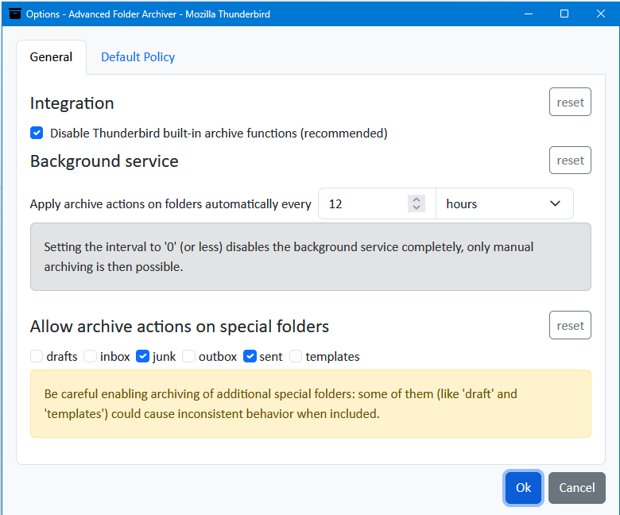
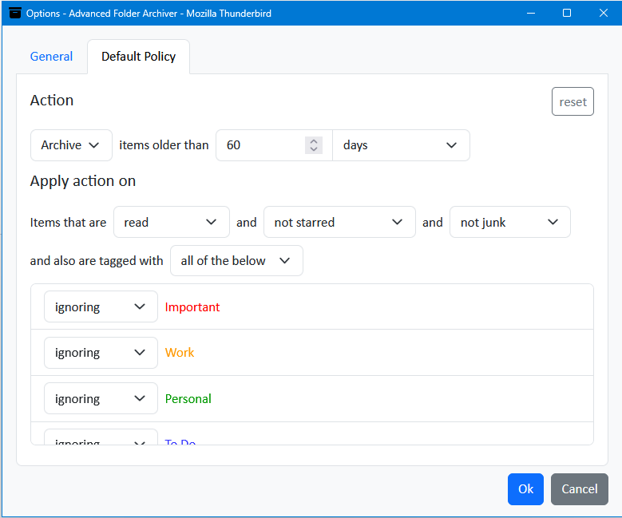
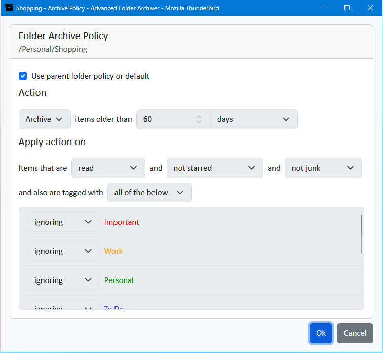

#  Thunderbird Add-on: Advanced Folder Archiver
  [](../../releases/latest)

Drop-in replacement for archive function built in [Mozilla Thunderbird](https://www.thunderbird.net), it was originally developed to meet enterprise archive requirements Thunderbird itself could not, we are convinced it could be of value for all Thunderbird users.

## Features
- Supports individual archiving policies for each folder
- Supports various message filters in archiving policies
- Archives local and remote folders (periodically by automatic trigger or by manual trigger)
- Archives individual messages (by manual trigger)
- Groups archives by the year of message creation
- Preserves original folder structure in archives
- Supports automatic deletion instead of archiving (via policy)

## Screenshots
### General Options

### Default Policy

### Folder Policy


## Installing
As long as the add-on isn't published to [Thunderbird Store](https://services.addons.thunderbird.net) (planned), you can download a [release](../../releases/latest) package and then install it under Thunderbird -> Tools -> Add-ons and Themes -> Tools for add-ons (gear button) -> Install Add-on From File... . Upon installation you will be presented with the options dialog where you can (and should) customize the add-on settings.

## Building
For building the add-on only [Node.js](https://nodejs.org/) is required (minimum v22 is recommended). After cloning the repository open the terminal in the project directory and run
```sh
npm install
npm install --workspaces
npm run package
```
This commands would build the sources and generate the XPI package in `dist` directory.

## Contributing
All contributions to development and error fixing are welcome. Please always use `develop` branch for forks and pull requests, `main` is reserved for stable releases and critical vulnarability fixes only.